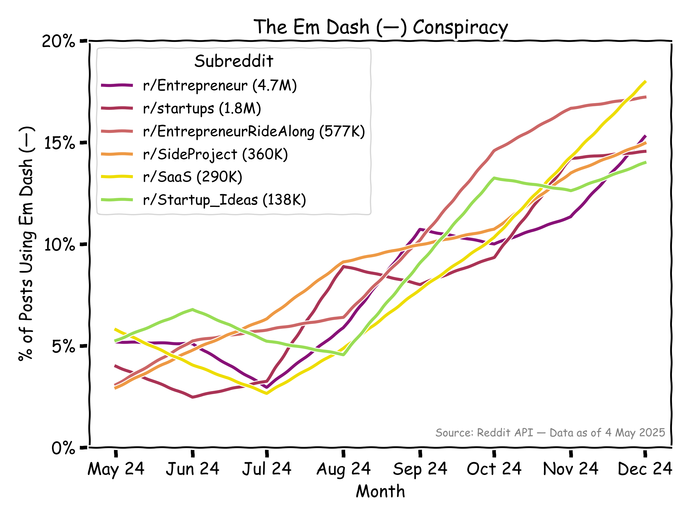

# The Em Dash Conspiracy

This chart tracks em dash (—) usage across tech and startup subreddits over the past year, a stylistic marker often found in AI-generated writing.

Generated on **May 4, 2025**, using Reddit’s API to fetch the **top 1000 posts from the past year** in each subreddit. This introduces time bias: recent posts are underrepresented unless they quickly gained high scores. Treat it as a signal, not proof.

